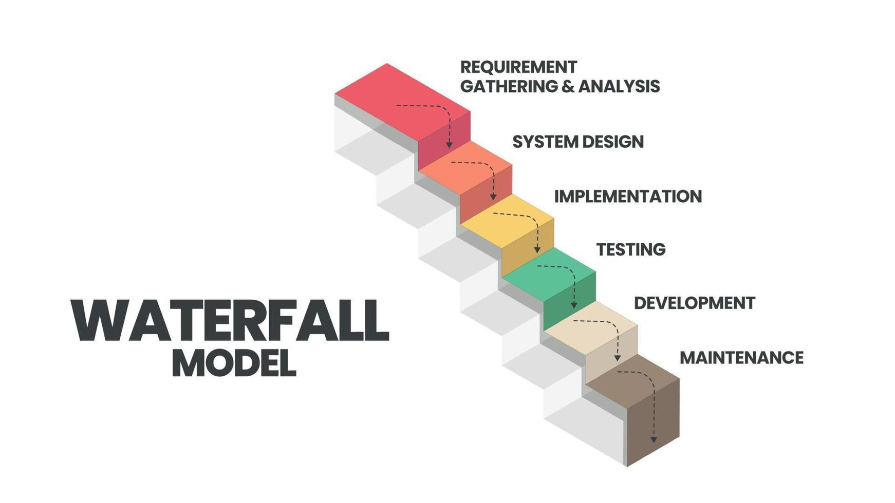

# General Concepts

This section will describe the basic concepts you need to know before reading technical topics related to Devops. Also, it will give you an overview of the microservice architecture style. 

## Agile Movement
Before talking about Devops, we need to understand how it came to be what we know today. Traditional development life cycle consists of several dependent stages with a straight line flow of work. For example, they first collected all the requirements that the application needed to have, then they designed what would be the application based on this requirements. After this, they started to develop the real application and, finally, they tested and deploy it. Each of these stages generated large amounts of documentation, a long time before a piece of software was developed. A stage could not start if the one that predicted it had not finished.  
Agile movement was introduced as a new way of develop software. A way in which you do not need to have all your requirements specified from the beginning. One in which you would produce some real application as soon as possible; that allowed you to change on the fly. 

## Devops
To improve further Agile movement, a way was needed to reduce the transition from development to operation. Devops is intended to bridge the gap between operations and development teams using continuos practices. It combines software development, quality assurance, and operations. Although Devops was born as culture from a theoretical perspective, the pragmatic way is to treat it primarily as a role. We will not deal with this discussion here. 

## Application Programming Interface
Another concept you will often hear is an API or Application Programming Interface. Abstraction is one of the fundamental concepts in Computer Science. It means removing unnecessary details from systems implementation. For example, you do not need to know about Chemistry of Materials in order to use a CPU, or you do not need to know how an Operating System works if you want to create a website. APIs are an example of abstraction because it let your system to communicate with other systems without having to know how they are implemented. This communication has to be somehow standard between the parties involved. SOAP (Simple Object Access Protocol) and REST (Representational State Transfer) are specifications exchange of information between APIs. The former is a protocol while the latter is an architectural style which means there is no obligation on how to implement it. 

## Microservice Architecture
You will work with an application based on a microservice architecture style. Also, it is an architecture that you will often find in your daily work. This is why we think is important for you to have a high-level overview of this style.  
Microservices are a way to structure your application as a collection of services that are:
* Loosely coupled. which means that you can replace one service with another technology and must be transparent to the other services.
* Independently deployable. Though the set of these services make up your application, we should be able to deploy it without any dependencies on each other.
* Owned by a small team. Due to its loosely coupled feature, each service can be developed by different teams.

## References
* [The Agile Manifesto](https://agilemanifesto.org/)
* [What are microservices?](https://microservices.io/)
* [Abstraction](https://isaaccomputerscience.org/concepts/dsa_ctm_abstraction?examBoard=all&stage=all)
* [What's an API](https://www.redhat.com/en/topics/api/what-are-application-programming-interfaces)
* [What is Devops? REALLY understand it](https://www.youtube.com/watch?v=0yWAtQ6wYNM)
* [DevOps and AWS](https://aws.amazon.com/devops/)