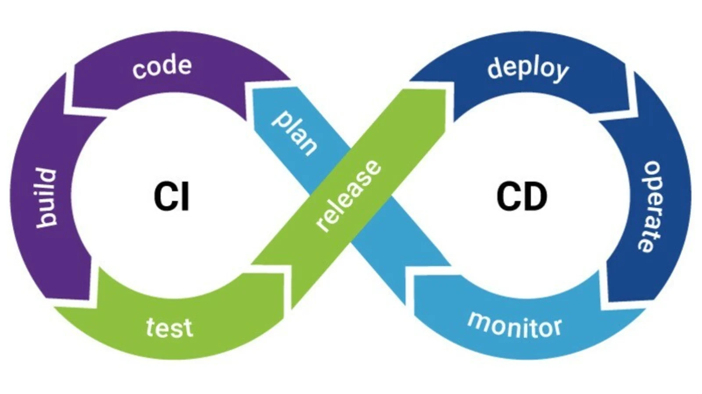

# Continuous Integration (CI) and Continuous Deployment (CD)

Great work! you've almost finished the Ramp Up for starting working as a DevOps Engineer! on this chapter we are going to cover one of the most important
elements of the DevOps Culture, which are the Continuous Integration/Continuous Deployment processes.

As you may know, an Application's development has a lot of items to cover, if a team is working on developing a quality application, in addition to work
on developing application's features, they have to create tests for making sure that everything is working ok, and it doesn't have any bugs, they have to
test constantly each time a new feature is developed, or even if a change is made on the code. 

Another question rises up when we think what will happen once that application is finished, what do we do with it? how can we deliver it to the final client
in a fast and reliable way? if your application is receiving updates after being published, how do we deliver these updates to final clients? how do we
make sure that the final product is not broken or contain bugs?

This is where CI/CD Processes enters the game, in a nutshell, they are automated processes who are responsible for solving all these questions we just
raised up above, let's see how.

## What is Continuous Integration (CI)? 

Continuous Integration is the process responsible for being constantly testing your application, this requires you to push changes constantly, if you add a change
to your code, Continuous Integration will build your application and test it, this way you'll make sure that everything is working ok, if something is broken,
thanks to Continuous Integration you'll find that error faster, if you're not constantly testing, errors can appear once you deploy your application to
production, reducing the application's quality and worsening the final client experience. The faster you find an error, the faster you can fix it, and the
better your application will be.

## What is Continuous Delivery (CD)?

Continuous Delivery is an extension of CI, after you have implemented your application's feature correctly, and make sure
that everything is working ok testing constantly with every change you made, what should we do? That's right! we need to deploy our application!
Continuous Delivery will deploy your application to a cloud provider on non-production environments, and even run monitoring processes if there are any 
configured in order to keep an eye on your application's performance. CD can take care of the creation of production releases too, but it stops there.
With Continuous Delivery deployments to production environments are not done automatically, an approval is required before production deployments, but once 
this deployment is approved, you should be able to deploy with just a click to production environments.

## What is Continuous Deployment (CDP or CD)?

Continuous Deployment, also called CD, is pretty similar to Continuous Delivery, the main difference here is that all the process is fully automated,
included deployments to production environments. This final step of deploying to production differ mostly because of business reasons, some business requires
an approval for deploying to production and don't allow these deployments to be done automatically.

##

Those were the main purpose of CI/CD Processes, however, their implementation can differ among developers, you can add as many "middle" stages as you want,
if you want to add a **stage** for scanning your code with a static code analyzer on your CI implementation, you can do it.

Remember, DevOps is a Culture, meaning that, for these processes to work correctly, all your team needs to collaborate and work aligned with this culture and
their purposes and processes, for CI/CD to work and to be effective and continuous, developers need to push their changes constantly, at least once per day,
with more pushes per day, the more continuous your development will be, and the better your application's quality will be.

Finally, a little note here, CI/CD Processes are part of a bigger picture, there's no point on implement a CD without CI for instance, their purpose is
to facilitate the development, improve the application's quality and save money and time by preventing and not regretting, here's a diagram that can
help you understand the difference on these processes a better:

Now, you may have wondered until this point, how can I create my own CI/CD processes? there's a word for that, **Pipelines** 

## What is a Pipeline?

Technically speaking, a Pipeline is a kind of software architecture, that consists of a chain of elements arranged so that the output of each element is
the input of the next, this way, the data **flows** through the application, just like a "pipe of water".
Typically, the implementations we do for CI/CD processes use this architecture, we call it "CI/CD Pipelines", you can have one Pipeline for the CI and
another one for the CD, or you can have several for your CI, the implementation is yours, the sky is the limit!
But there's another question we need to answer, where do we run these pipelines? the answer is **Automation Servers.** 

## What is an automation server?

An Automation server is an application that exposes programmable objects (also called Automation objects) to other applications, they allow you to
automate certain procedures by accessing the objects and functionality the server makes available. Thanks to Automation Servers, you can create your
CI/CD pipelines, which would be automating **build and test** processes for CI and **deployment** processes for CD.
By exposing your pipelines, you can allow VCS tools to automatically run your CI pipeline, for example, each time you make a commit, ensuring that
you are constantly testing every change you made to your code, and then, triggering automatically your CD pipeline, for example, each time a PR is approved,
meaning that when your code changes are integrated on your master branch, the application will be deployed automatically.

### Most used automation servers

* Jenkins
* Travis CI
* GitHub Actions
* CircleCI
* TeamCity
* Bamboo
* GitLab
* Azure Pipelines

## Best practices for coding CI/CD Pipelines

* **Only build once per pipeline build**: In order to avoid introducing inconsistencies, you should use the same build artifacts throughout all the
pipeline you're running.

* **Control your pipeline's duration**: Each run of your pipeline shouldn't exceed 5 minutes of duration (although this is very difficult to achieve), try
to reduce the execution time as much as possible, if the runs are too long it will become a bottleneck for developers.

* **Use your pipeline to control good practices on developer's code and repositories**: For example, controlling the number of branches a repository
can have, or controlling naming conventions for branches or tickets, if some of these rules is broken, you can throw an error so the pipeline doesn't 
finish until you accomplish all the constraints.

* **Run your pipelines in different instances from the one your automation server is running**: Your automation server should be like a **master node**
which control **slave nodes** where the pipelines should run, this way, you can create and delete these nodes on demand and won't hinder master node
performance.

* **Execute your CI pipelines on each commit**: You should configure your application's repository to be linked to your Automation Server through a 
webhook, and send a trigger on each commit, this way you'll test each change developers do and allow them to identify errors faster.

* **Use Multi-branch Pipelines for your CI**: If your Automation Server allows it, you should use Multi-branch Pipelines, integrating your CI
pipelines with branching strategies such as GitFlow, testing not only important branches such as develop or master, but allowing developers to
test on their "feature" or "hotfix" branches.

* **Fail fast**: If there's something wrong with the application's code, your pipeline should fail as fast as possible, so developers know that
something is wrong and start working on it as soon as possible.

* **Keep your instances "clean"**: Your pipeline configuration and slave nodes' configuration should be as similar to production as possible
(as your other environments should be too) in order to reduce configuration issues and create uniformity among environments, this way you'll
reduce "dirty context" issues too.

* **Add monitoring to your deployments**: It's always a good practice to keep an eye on how your instances are doing, specifically if we are
talking about production, also, you should add different notifications for certain situations, for example, if your instances exceed 80% of
CPU usage.

## Challenges

For the challenges, let's focus first on the CI, and then on the CD.

### CI

1. **Design and create a diagram of your CI Pipeline**: Before we start throwing code, let's internalize the concepts first, create a diagram
in a way that you can identify each stage that makes up your pipeline and their internal steps.
2. **Choose an Automation Server**: We saw one of the most used Automation Servers on this chapter, give them a look and choose the one you like most!
3. **Implement the pipeline you created in the Automation Server you chose.**: Let's implement the main steps of the CI process that we saw on the diagram before!
   1. **Build your application**: remember that you created several dockerfiles before for your application? create your pipeline so you build your docker images.
   2. **Upload your docker image to your docker registry**: You need an account on DockerHub for this step, push your docker images to DockerHub for pulling them later.
   3. **Execute your application's tests!**: Some services of your application have tests, execute them! add errors to your code and test how your pipeline should
   fail if a test doesn't pass successfully, remember to **fail fast**.
4. **Configure your application's repository to have a webhook to your pipeline and trigger builds on each commit.**
5. **Configure your Automation Server to use a slave node for executing your pipelines**: Instead of doing it all on the same instance, create another
instance on AWS and link it with your Automation Server instance to use it for running builds.

### CD

1. **Design and create a diagram of your CD Pipeline**: Just as you did with your CI Pipeline.
2. **Implement the pipeline you created in the Automation Server you chose.**: Now let's implement the deployment process!
   1. **Set up your infrastructure**: create an EC2 Instance and install docker on it. 
   2. **Pull your docker image**.
   3. **Run your containers with docker!**: You can do it as we did on the virtualization chapter, having one instance per tier or service, but instead
   of running them directly, use Docker for running containers on each instance.
3. **Choose the policies of when you are going to deploy**: Similar to when we configure our webhook on the application's repository, for example, 
you may want to deploy each time a PR is merged, who should be allowed to deploy on an organization and on which environments? 
4. **Research and learn about deployment strategies.**: A deployment strategy is a way of changing or upgrading your application without tearing it down,
some examples of strategies are: **blue-green deployment**, **Rolling strategy**, **Canary deployments**, etc.
5. **Choose a deployment strategy and present it to your trainer!**: You could make slides for this, or a diagram, or both! present the deployment strategy
you want to implement to your application, explain why you chose that strategy, why is better than the other ones in your application and how would improve
your application's performance.