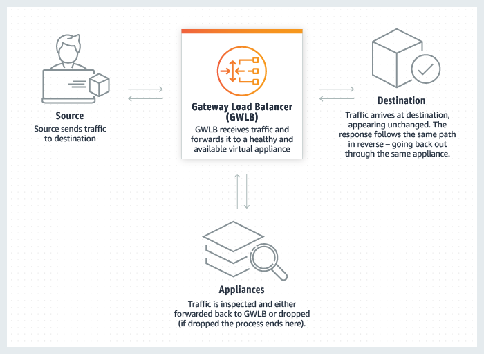

# Cloud Computing
One of the most important parts of an application's development lifecycle is the deployment, where are we going to deploy 
our application? as we saw previously on chapter 7, there are several options to do this. We can use a virtual machine to
run our application, or even better, run it on a container where we'll have only the required items to run our app without
consuming unnecessary resources, the problem now is that these VMs or Containers have to run on an actual machine, where
are we going to have this machine?

One option could be hosting our applications on physical servers, but this would require a large investment for buying the
servers, also we'll need a physical space to store the servers, this space needs to have enough electric power and cooling,
because the servers are going to be running there, generating heat, if the space doesn't have enough cooling power the heat
generated by the servers can damage them, adapting this physical space also requires a large investment.

After having all the infrastructure we'll need to configure all the servers with a specific OS and they need to be linked
on the same network in order for them to be able to communicate. Also, we need a thorough networking configuration for
allowing external computers to access our application without accessing sensitive information, this would require firewalls
and other technical configurations that can take up even months to be finished, after this we'll need someone to maintain
these servers and making sure that everything is working without issues.

Running an application on a server and exposing it to the internet is not an easy task, right? here's where **Cloud Computing**
enters the game.

## What is Cloud Computing?

Cloud Computing allows companies to acquire computing resources (such as instances on the cloud) where they can run their
applications using resources on demand, this means that if your application needs 2GB of RAM and 4 cores of CPU to work,
you can access them without needing to buy any physical servers, just paying for the resources you're going to use running
your app. Cloud Computing also allows you to buy more resources if needed without much trouble.

Thanks to Cloud Computing we save the huge tasks of provisioning, configuring, managing or maintaining the servers, we
only need to pay for the resources we need, and we can be sure that the servers are going to be well maintained,
because big companies such as Amazon (with AWS), Google (with GCP) and Microsoft (with Azure) are the responsibles for
taking care of these servers.

## Cloud Computing Models

There are three types of Cloud Computing service models:

* **Infrastructure as a Service (IaaS)**: It offers on-demand computing and storage services.
* **Platform as a Service (PaaS)**: It provides a development and deployment environment for creating applications on the cloud.
* **Software as a Service (SaaS)**: It facilitates access to software services via the Internet.

**Advantages**

* **Flexibility**: Cloud Computing allows you to access to their services from anywhere on any device, you only need an internet connection.
Also, you can scale up or down computing resources whenever you need it.
* **Efficiency**: Cloud Computing allows you to build and deploy applications faster on a reliable infrastructure.
* **Secure**: Thanks to Cloud Computing you can be sure that the servers that will run you application are going to be secured with thorough
security protocols and stored on a guarded establishment.
* **Avant-garde**: Cloud providers keep their infrastructure updated with cutting-edge technology, you can be sure that your application will
run on servers that aren't going to be obsolete.
* **Cost-effective**: Cloud Computing allows you to consume computing resources on demand, you don't need to buy additional resources if
they are not required, saving you money, Cloud Computing also allows you to automatically scale up or down computing resources based on
how many resources your application needs.

**Disadvantages**

* **Internet Dependency**: In order to manage your computing resources, you need an Internet connection.
* **SaaS Version Management**: With SaaS Services you can't access previous versions of the software provided.
* **Configuration Autonomy**: While Cloud Providers usually give you several tools to manage your computing resources, their networks and
their configuration, if you want a fully customized service you may need to have your own physical servers.
* **Information Control**: You have less control over the information that servers receive.

For working with Cloud Computing we are going to use **Amazon Web Services (AWS)** or **Microsoft Azure** as Cloud Provider, nevertheless, you can work with other Cloud providers such as Google Cloud Platform (GCP), etc.

## How do we work with Cloud Computing?

We are going to see two approaches on how to take on Cloud Computing, the first one will be a manual approach. You can get used to
AWS elements and how to navigate through the AWS management console in order to create Instances, accessing to their Command Lines,
running your application, configuring their network, etc.

The second approach will be Infrastructure as Code (IaC) which we'll talk about on the next chapter.

# AWS Essentials

Let's get to work! AWS has a lot of services that you can use for running your applications on the cloud, for this RampUp we'll use
the most common ones that will show you how we can run a simple application, you will learn about the whole toolset of AWS and other
Cloud Providers with the experience!

Before starting, remember to always tag all your resources the following way. Otherwise, you can face issues when provisioning a new resource.

Don't forget to choose resources that are available on the AWS Free tier! they are more than enough for you to complete the Ramp Up and that
way you'll save costs to the company! (you can see if a resource is on the Free tier if it has the label **Free tier eligible**).

**EC2 Instances**

Amazon Elastic Compute Cloud (EC2) is basically a service that offers a virtual machine hosted on a Server on Amazon Data Centers, you
can choose the resources for these virtual machines, called Instances, like how much RAM you want on the instance, the number of CPU
cores that the instance will have, how much storage the instance will have, you can even choose if you need dedicated graphic resources
for your instance.

EC2 Instances are usually divided on several types that have different "sizes", types define how many resources an Instance has, here
are some examples:

* **t2.micro**: General Purpose instance with the following characteristics:
  * 1 vCPU running up to 3.3 GHz (Intel Xeon Scalable processor)
  * 0.5 GiB of Memory (RAM)
  * Low Network Performance
  * This instance is under the AWS Free Tier, meaning that you can use it for free
* **t2.xlarge**: General Purpose instance with the following characteristics:
  * 4 vCPU running up to 3.3 GHz (Intel Xeon Scalable processor)
  * 16 GiB of Memory (RAM)
  * Moderate Network Performance
* **p4d.24xlarge**: Accelerated Computing instance with the following characteristics:
  * 8 NVIDIA A100 Tensor Core GPUs
  * 96 vCPUs running up to 3.0 GHz (2nd Generation Intel Xeon Scalable Processor)
  * 1152 GiB of Instance Memory (RAM)
  * 320 GB HBM2 GPU Memory
  * 400 ENA and EFA for Network Bandwidth
  * Compatibility with GPUDirect RDMA
  * GPU Peer to Peer 600 GB/s NVSwitch
  * 8 x 1000 NVMe SSD (GB) storage
  * 19 Gbps of bandwidth

Based on the "size" of an instance, it will be more or less expensive.

For provisioning an EC2 Instance automatically (like on the Virtualization chapter) make sure you add your provisioning script on the user data
section while creating your EC2 Instance:

This is how you will see instance properties on AWS (EC2 Dashboard), you can see the Public IP which you can use to access your running applications 
clicking on **open address**, if you want to connect to your instance, you can click on the Connect button:

Here we have 2 options for connecting to your instance.

**Option 1**

You can connect using an SSH Client, Windows and Linux CLI already have an SSH Client integrated, you just need to copy the command showed on
the **Example** section (remember to have your Key file on the same directory where you execute the command or give the full path to the file)
and run it on your CLI.

**Option 2**

This option allows you to access to your instance CLI through your browser, you just need to click on the **connect** button, and it will take
you to your CLI!

**Security Groups**

Security groups are a set of rules that will define a "firewall" for your EC2 Instances, here you will
define which IPs will be allowed to enter the instance and which protocol will they use for accessing,
for instance, you would want your IP for being the only one allowed to enter through SSH on your EC2
Instance, but if you're going to run an application on your instance, you would want your instance to
be open to the internet through the HTTP protocol on the port your application is listening on for requests.

When creating a security group you need to be careful with the rules you have, usually these configurations are more than enough to run a simple application and allowing access from the internet:

* **Allow HTTPs and HTTP traffic from the internet**, this will enable ports 80 and 443.
* be careful when you enable SSH traffic, you should choose **My IP or Custom** options only, for setting up specific IPs that will have access to
your instance, allowing all IPs to log in through SSH to your instance is a bad practice and a potential security flaw!

**Amazon VPC**

Amazon Virtual Private Cloud (Amazon VPC) is a service that allows you to define your own logically isolated
virtual network on Amazon servers, here you can place resources, configure their connectivity and security on
the network, you could define a set of private IPs for the instances to have, you can define how your network
will communicate with other networks on different regions, it's like setting up a private network, but on the cloud.

**Amazon Simple Storage Service (S3)**

Amazon S3 is an object storage service, in simple terms, is a storage service, like Google Drive, but offered by Amazon. It includes security
features for your data and tools for managing your information, Amazon S3 offers storage in the form of "buckets"
where you can upload your data, each bucket is stored on a specific region, you can specify access controls and
management options, there are replication tools if you want to keep an automatic backup of your bucket, it allows you
to store a static website too.

**Amazon Relational Database Service (RDS)**

Amazon RDS is a relational database service that allows you to store your database on the cloud, the server on which the database
management system is running on is maintained by Amazon, meaning that you don't need to perform any configuration tasks for setting
up your database management system and is guaranteed to have high availability and cutting-edge security, you have options for making
backups of your information and replicate data through different servers running database management systems.
You can choose from seven different engines:
* Amazon Aurora with MySQL compatibility
* Amazon Aurora with PostgreSQL compatibility
* MySQL
* MariaDB
* PostgreSQL
* Oracle
* SQL Server

**Amazon EC2 Auto Scaling groups (ASG)**

Amazon EC2 Auto Scaling allows you to create a High Availability model to your servers, scaling up or down computing resources based on
a specific condition, this is done through Auto Scaling groups, which are groups of instances that you want to be replicated (scaling up)
or eliminated (scaling down), for this you need to provide the type of instance you want to be created automatically, and a template for
provisioning that instance with the required dependencies for running your application, for instance, if you are receiving a lot of 
requests on your application and your server's usage percent is over 80%, then you can configure your Auto Scaling group to scale up 
resources automatically in order to keep a good performance on your application, the same can be applied afterwards, if the server's 
usage percent is below 40% you can configure your Auto Scaling group to scale down resources automatically.

In order to set up an Auto Scaling group you need to configure a Launch Template, a Load Balancer and its target groups with their listeners.

If you want to learn more about how Auto Scaling groups work and how to create them check the getting started documentation from AWS:
https://docs.aws.amazon.com/autoscaling/ec2/userguide/get-started-with-ec2-auto-scaling.html

**Launch Templates and Launch Configurations**

Launch templates and Launch configurations are, as their name says a template for creating EC2 Instances from scratch. You can specify the ID of the AMI that your instance is going to use, the instance type, a key pair, security groups, and other parameters used to launch EC2 instances, the main difference between them is that launch templates allow you to have multiple versions of a template.

Launch templates also allows you to use newer features of Amazon EC2, like the generation of EBS Provisioned IOPS volumes, EBS volume
tagging, T2 Unlimited instances, Elastic Inference and Dedicated Hosts to name a few. Our recommendation is to use Launch Templates
as they have more functionalities for Amazon EC2 and EC2 Auto Scaling, Launch Configurations won't have support for new EC2 features
in the future and Amazon strongly recommends not to use them.

**Elastic Load Balancing**

Load balancers are tools that help you distribute network traffic into multiple instances or containers in order to improve application scalability. This would allow, for instance, having several EC2 instances running the frontend part of your application and distributing all requests among these instances in order to improve the performance of your application.

Load balancing also helps to secure your applications with integrated certificate management, user-authentication and SSL/TLS decryption, delivering
applications with high availability and automatic scaling, and monitoring the health and performance of your applications in real time.

There are four types of load balancers on AWS:

* **Application Load Balancer (ALB)**: This load balancer works at the application layer of the Open Systems Interconnection (OSI) Model for networks modeling. You can see it here:

Application Load Balancers allow you to define how you will route your application's traffic and where based on a set of rules, this kind of load balancers are context-aware and can direct requests based on a single or a combination of variables because it works on the application layer, it can balance the traffic based on the application's behaviour and not solely on server (Operating system or Virtualization layer) information, it performs content-based routing checking the contents of the HTTP request header to determine where to route the requests.

Here's an AWS diagram that briefly explains an Application Load Balancer functionalities:

Don't worry if this seems a bit confusing! once you start working with it, you'll understand it better. Here's an example of an ALB creation on an ASG:

* **Gateway Load Balancer (GWLB)**: It helps you to easily deploy, scale and manage third-party virtual appliances giving you a gateway for distributing traffic across multiple virtual appliances while scaling them up or down based on demand. You can find these third-party virtual appliances on AWS
Marketplace.

* **Network Load Balancer (NLB)**:  This load balancer works at the transport layer, meaning that it can only perform distribution of traffic based on network variables, such as IP address and destination ports. It can't take anything of the application layer like content type, cookie data, custom headers, user location or application behaviour. This load balancer only forwards requests without checking the HTTP request headers.

This kind of load balancers can't ensure high availability for the application because it bases decisions only on network and TCP-layer variables and has
no awareness of the application at all. It determines availability based on the ability of a server to respond to IMCP ping command, on the other hand, 
Application Load Balancers can verify that the response content of a request is expected based on the input parameters.

**Target groups, listeners and rules**

Target groups are used for routing requests sent to a load balancer to one or more registered targets. To do this you have to specify listener rules which would be, for example, receiving a requests to port 80 with some specific headers. When that condition is met, traffic is forwarded to a specific target group (set of instances).

You can read more about target groups here:
https://docs.aws.amazon.com/elasticloadbalancing/latest/application/load-balancer-target-groups.html

## Challenges

Let's get to work! you will find some tasks in this section where you can practice what we learned on this chapter

Log into AWS management console with your training account, if you don't have one please reach out to your trainer, 
he should be able to give you the credentials or the name of the person who can help you with this.

### Cloud Infrastructure diagramming

Before we start working on AWS, your first task will be making a Diagram about how your cloud infrastructure will be for
running your application with High Availability using all the components we saw on this chapter, you can use the tool of
your choice, like draw.io, Microsoft Visio, etc. 

Use the AWS Calculator to create an estimate of how much this cloud infrastructure will cost monthly.
https://calculator.aws/#/

Once you finish the diagram, show it to your trainer and discuss together about how you will implement this infrastructure and why you decided to use each component of your infrastructure.

### Running your App with EC2 Instances

First, let's get a little warmed up with AWS running your app with only EC2 Instances, just as we did on the previous chapter
with Vagrant:

**1.** Create two EC2 Instances, just as we did with vagrant, one for the backend, another for the frontend.

**2.** Choose the AMI (OS) you want to use on your instance, We suggest using Amazon Linux 2 or Ubuntu.

**3.** Create a new EC2 Instance to work as your **bastion host**. This will be used to access through SSH to your private instances and the access must be allowed only from your IP.

**4.** Set up your instances so your backend instance belongs to a private subnet and the frontend belongs to a public
subnet, that way your instances should be able to communicate, but you shouldn't be able to log in through ssh to your
backend instance (you can access to it through your **bastion** instance logging in through ssh to your **backend** instance).

**5.** Provision your instances and run your application just as you did on the previous chapter while provisioning your Virtual Machines.

**6.** Check that your app is running and try to access it through the public IP and port you assigned for the frontend, double check that
everything is running ok.

### Running your App with High Availability

Now that you warmed up let's start with a High Availability infrastructure! now you need to build the same infrastructure you designed on
the diagram, with Auto Scaling groups, Load balancers, Launch templates, and Target groups. To do so, please create a new version of your diagram using all these AWS resources and present it to your trainer.

You need to configure your Auto Scaling group for provision automatically your frontend and backend instances. Each time an instance is
created, it has to be able to configure itself and run your application without you to move a single finger. Once you finish creating
your Auto Scaling group, verify that your app is running ok and then delete one instance of your Auto Scaling group and check if its
created again and being provisioned correctly so your app keeps working even if an instance gets down.

Once you created the load balancers, create a rule for redirecting a request from port 80 of your frontend instance and sending it
to your application's home page directly without needing to add the port on the browser's url.

**BONUS:** It will be great if you can show your app running correctly on port 443 and using a valid certificate (you can use cerbot). If you do it, remove the access to port 80 and send all requests to 443.